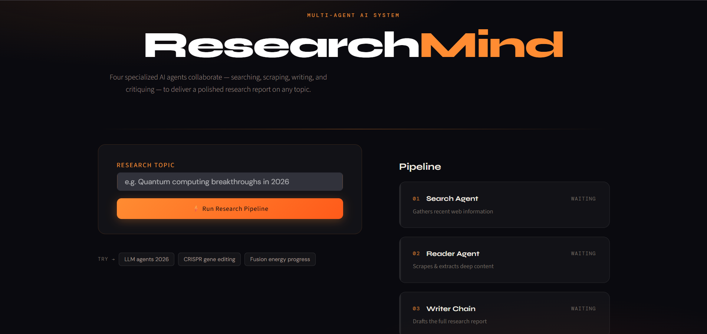
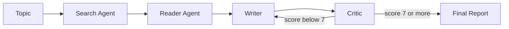

# 🔬 ResearchMind: Multi-Agent AI Research System

ResearchMind is a multi-agent research assistant. Give it any topic and four specialized AI agents work together to **search the web, read the best source, write a report, and critique it**. If the critic isn't satisfied, the report is sent back for revision.

It runs from the terminal or from a Streamlit web interface with live progress.

<!-- Add a screenshot of the UI here:  -->

---

## ✨ Features

- **Four cooperating agents**: Search, Reader, Writer and Critic
- **Self-improving loop**: the critic scores the report out of 10 and sends it back to the writer if the score is below 7
- **Live pipeline UI**: watch each agent go from *waiting* to *running* to *done* in real time
- **Friendly error handling**: clear messages for Gemini errors (busy server, rate limit, bad API key) with a **Try again** button
- **Download the report** as a Markdown file
- Works from the **terminal** (`main.py`) or the **web UI** (`app.py`)

---

## 🧠 How it works



| Step | Agent | What it does |
|------|-------|--------------|
| 1 | **Search Agent** | Finds recent, reliable web results for the topic |
| 2 | **Reader Agent** | Picks the most relevant URL and scrapes its content |
| 3 | **Writer** | Drafts a full research report from the gathered material |
| 4 | **Critic** | Reviews the report, gives feedback and a score out of 10 |

The workflow is built with **LangGraph**: the critic's score decides whether the graph ends or loops back to the writer.

---

## 🗂️ Project structure

```
.
├── agents/
│   ├── search_agent.py     # finds sources on the web
│   ├── reader_agent.py     # scrapes the most relevant page
│   ├── writer_agent.py     # writes the report
│   └── critic_agent.py     # reviews and scores the report
├── graph/
│   ├── state.py            # shared state passed between agents
│   ├── nodes.py            # one node per agent
│   └── workflow.py         # LangGraph workflow and revision loop
├── tools/
│   ├── web_search.py       # web search tool
│   └── scraper.py          # page scraping tool
├── app.py                  # Streamlit web UI
├── main.py                 # terminal version
└── README.md
```

---

## 🛠️ Tech stack

- [LangGraph](https://github.com/langchain-ai/langgraph): agent workflow and state graph
- [LangChain](https://www.langchain.com/): agents and chains
- [Google Gemini](https://ai.google.dev/) via `langchain-google-genai`: the language model
- [Streamlit](https://streamlit.io/): web interface
- Python 3.11

---

## 🚀 Getting started

### 1. Clone the repository

```bash
git clone https://github.com/<your-username>/<your-repo>.git
cd <your-repo>
```

### 2. Create and activate a virtual environment

```bash
python -m venv .venv

# Windows
.venv\Scripts\activate

# macOS / Linux
source .venv/bin/activate
```

### 3. Install dependencies

```bash
pip install -r requirements.txt
```

> No `requirements.txt` yet? Generate one from your working environment with `pip freeze > requirements.txt`.

### 4. Add your API keys

Create a `.env` file in the project root:

```env
GOOGLE_API_KEY=your_gemini_api_key_here
# Add any other keys your search tool needs, for example:
# TAVILY_API_KEY=your_key_here
```

Get a free Gemini API key from [Google AI Studio](https://aistudio.google.com/). **Never commit your `.env` file.**

---

## ▶️ Usage

### Web UI (recommended)

```bash
python -m streamlit run app.py
```

Open `http://localhost:8501`, type a topic, and click **Run Research Pipeline**.

### Terminal

```bash
python main.py
```

Enter a topic when prompted. The final report, critic feedback and score are printed in the terminal.

### Good topics to try

- Solid-state batteries for electric vehicles
- CRISPR gene editing: recent breakthroughs
- How large language model agents work

---

## ⚠️ Troubleshooting

| Problem | Cause and fix |
|---------|---------------|
| `503 UNAVAILABLE: high demand` | Gemini's servers are busy (more common on the free tier). Wait a minute and press **Try again**. |
| `429` / quota errors | You hit the rate limit. Wait a few minutes, use a lighter Flash model, or enable billing. |
| API key error | Check that `GOOGLE_API_KEY` is set in `.env` and restart the app. |
| `No module named 'graph'` | Run the commands from the project root folder. |
| `streamlit.exe` blocked by Windows | Use `python -m streamlit run app.py` instead. |

---

## 🔧 Configuration notes

- **Pass score**: the critic loop ends when the score reaches **7/10**, or after the maximum number of revisions.
- **Model**: change the Gemini model name inside the files in `agents/`. Lighter Flash models have higher free-tier limits.
- **Free tier**: one run makes many API calls (the search and reader agents each make several), so avoid running many topics back to back.

---

## 🗺️ Roadmap

- [ ] Resume a failed run from the step that failed
- [ ] Export reports as PDF
- [ ] Support multiple sources instead of one scraped page
- [ ] Save past reports and a history view

---

## 📄 License

This project is licensed under the MIT License. See the `LICENSE` file for details.

---

## 🙌 Acknowledgements

Built with LangGraph, LangChain, Google Gemini and Streamlit.

---

## 👨‍💻 Author
Harsh Adhana

B.Tech CSE | AI & Machine Learning Enthusiast

Interested in:

Artificial Intelligence
Machine Learning
Generative AI
LLMs
RAG
AI Agents
Model Context Protocol (MCP)

--- 

## ⭐ If you found this project useful
Feel free to explore the repository and connect with me on LinkedIn.